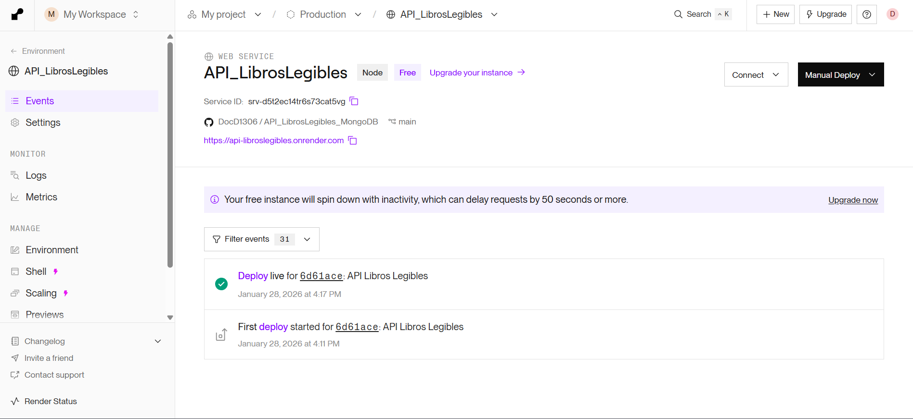
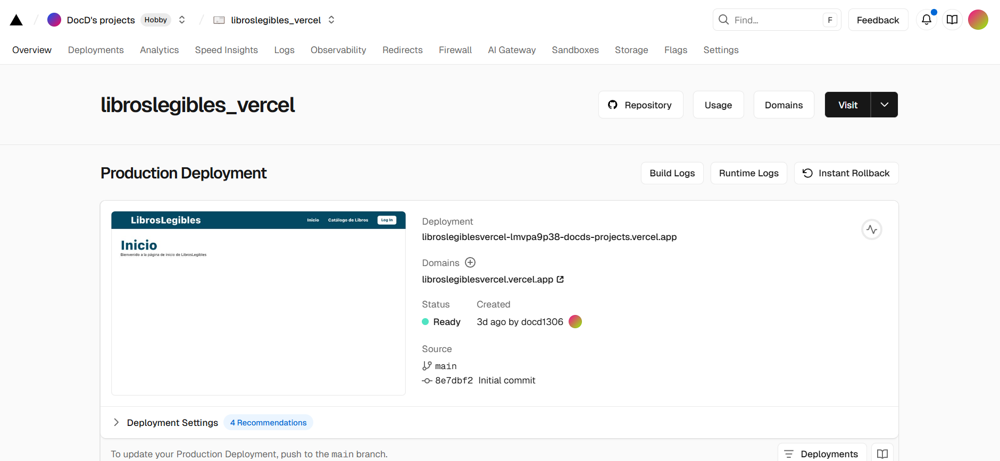
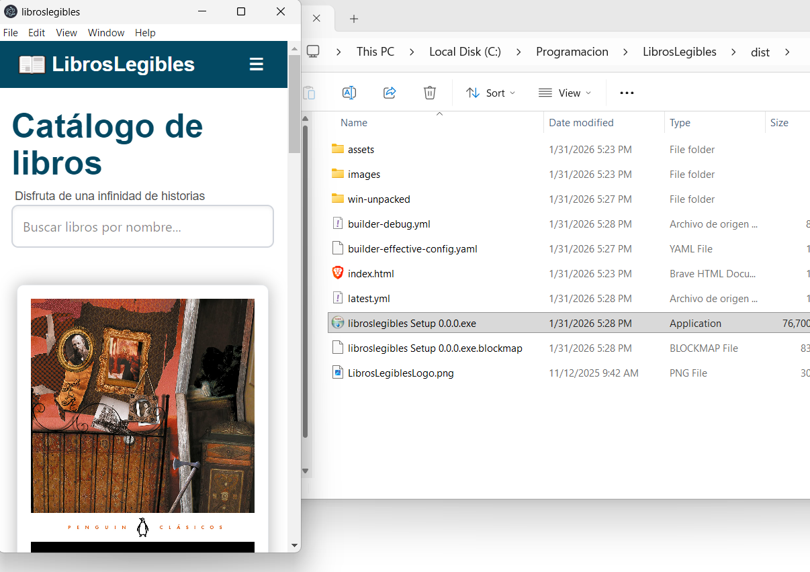
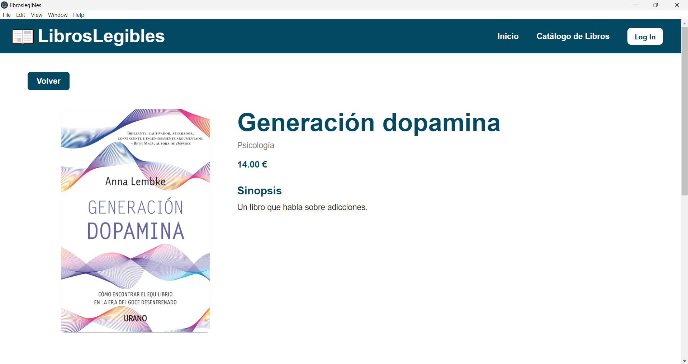

# LibrosLegibles

Alumno: 
**Diego Fernando Valencia Correa 2ºK**

---

## Despliegue de la aplicación 

URL de la API en Render: [https://api-libroslegibles.onrender.com/](https://api-libroslegibles.onrender.com/)

URL de la aplicación web en Vercel: [https://libroslegiblesvercel.vercel.app/](https://libroslegiblesvercel.vercel.app/)

El ejecutable original para la aplicación de escritorio se puede encontrar en la carpeta ./dist/libroslegibles Setup 0.0.0.exe  

Pero en la raiz del proyecto se puede encontrar una copia llamada "LibrosLegibles.exe".

## Reflexión 

#### ¿Dónde está desplegada cada parte? 

Se ha desplegado la API de LibrosLegibles (el backend) creada Node.js en la plataforma de Render. La base de datos MongoDB que utiliza dicha API está desplegada de manera automática en los servidores de MongoDB Atlas.

Para el despliegue del frontend creado en React y Vite se ha utilizado la plataforma Vercel.

#### ¿Qué problemas has encontrado durante el despliegue?  

A la hora de desplegar el proyecto React (el frontend) en Vercel hubo varios errores debido a que todavía estaban presentes los archivos de StoryBook.  

 Además, una vez fue desplegada la web, hubo más problemas a la hora de conectar con el backend en Render, esto fue debido a la falta de configuración de variables de entorno indicando la URI del backend en Render. Sin embargo, se pudo solucionar muy fácilmente añadiendola en la configuración de Vercel.

 
#### ¿Qué ventajas tiene el despliegue web frente al de escritorio?

El despliegue web tiene multiples ventajas como la actualización instantánea mediante push con Github, accessibilidad global independientemente del sistema operativo del usuario y simplicidad al no necesitar instalación.

#### ¿Por qué Electron no sustituye a una web? 

Electron no sustituye a una web porque hace un mayor uso de recursos en el sitema y por tanto gasta más batería que una web, además puede necesitar que el usuario descarge las actualizaciones o que permita que estas se instalen, haciendolo la utilización más compleja. También, Electron ocupa cierto espacio en el dispositivo, normalmente poco, pero aún así es una diferencia frente a utilizar solo el navegador.

#### Capturas de la aplicación de escritorio funcionando

